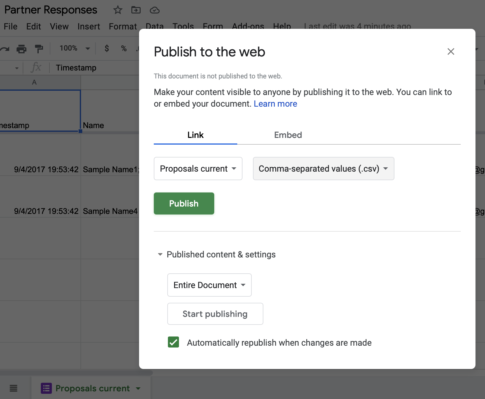

# application-matching
Display Google Forms data and preferences in custom format on web page. Used by Liberal Arts Action Lab to display applications from community partners, faculty fellows, and students.

## Live example
https://action-lab.org/apply/partners-and-proposals/

## Setup
- Create three Google Forms to collect responses in three Google Sheets v4: partners, faculty, students
- For each Google Sheet, File > Publish the first tab of responses in CSV format, in order to be processed by Papa Parse in the browser.

- Copy and paste each published CSV Sheet URL into main.js.
- In "Partners" Google Sheet, manually insert "Title" column, and manually insert short project name (example: FrogHollow Storytelling). Use as few words as possible.
- In "Partners" Google Sheet, manually insert "Display" column, and manually insert lower-case "y" to approve the row to be displayed on the public web page.
- On the public web pages, insert iframe for each Google Form, and also for this application-matching repo to display results.
- REMINDER: do NOT use this for high-security data, since the Google Sheet ID is visible in the code, and anyone can easily download and view the published CSV data.

## Credits
Created by Ilya Ilyankou (@ilyankou) for Liberal Arts Action Lab, Hartford CT

## Dependencies
- Papa Parse v5.3.1, https://www.papaparse.com
- jQuery v3.2.1, https://jquery.com/
